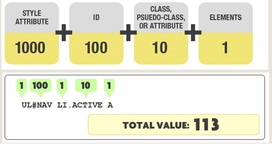

## CSS Sprites
1.简介
CSS Sprites在国内很多人叫css精灵，是一种网页图片应用处理方式。它允许将一个页面涉及到的所有零星图片都包含到一张大图中， 利用CSS的“background-image”，“background- repeat”，“background-position”的组合进行背景定位， 访问页面时避免图片载入缓慢的现象。
2.优点
（1）CSS Sprites能很好地减少网页的http请求，从而大大的提高页面的性能，这是CSS Sprites最大的优点，也是其被广泛传播和应用的主要原因；
（2）CSS Sprites能减少图片的字节；
（3）CSS Sprites解决了网页设计师在图片命名上的困扰，只需对一张集合的图片命名，不需要对每一个小图片进行命名，从而提高了网页制作效率。
（4）CSS Sprites只需要修改一张或少张图片的颜色或样式来改变整个网页的风格。
3.缺点
（1）图片合并麻烦：图片合并时，需要把多张图片有序的合理的合并成一张图片，并留好足够的空间防止版块出现不必要的背景。
（2）图片适应性差：在高分辨的屏幕下自适应页面，若图片不够宽会出现背景断裂。
（3）图片定位繁琐：开发时需要通过工具测量计算每个背景单元的精确位置。
（4）可维护性差：页面背景需要少许改动，可能要修改部分或整张已合并的图片，进而要改动css。在避免改动图片的前提下，又只能（最好）往下追加图片，但这样增加了图片字节。

## 标准盒子模型、IE盒子模型、Flex弹性伸缩盒子模型  
[box-sizing](https://developer.mozilla.org/zh-CN/docs/Web/CSS/box-sizing)
### 1. 标准盒子模型

### 2. IE盒子模型（又称怪异盒子模型）

### 3. Flex弹性伸缩盒子模型
[阮一峰flex](http://www.ruanyifeng.com/blog/2015/07/flex-grammar.html)

## 使用css,让一个div消失在视野中

## 不考虑其他因素，下面哪种渲染性能比较高
```css
.box a{

}
a{

}
```
下面那种，因为浏览器读取选择器的顺序是**由右到左**进行，上面例子会先读一遍a再读.box

## css position  
CSS position属性用于指定一个元素在文档中的定位方式。top，right，bottom 和 left 属性则决定了该元素的最终位置。  
+ static | relative | absolute | sticky | fixed
1.static  
默认，在正常文档流，根据HTML排版的flow移动
2.relative
除了有和static相同的特性：跟随HTML排版流程去定位之外，可以设置top left right bottom相对定位
3.absolute  
被移除文档流，不会跟随HTML排版的流程移动  
当absolute的元素所在的页面有卷轴，即，可以滑动时，它会随着卷动而移动  
absolute可以重叠，
当absolute作为父元素，其子元素也是absolute时，子元素将相对父元素定位
- absoulte子元素相对relative父元素进行定位
4.fixed  
fixed相对屏幕进行定位，即使卷动页面也会一直保持在那位置
即使放到relative里面，也是相对body定位  
5.stick
粘住，

## 优先级   

**权重的进制是并不是十进制，CSS 权重进制在 IE6 为 256，后来扩大到了 65536，现代浏览器则采用更大的数量**
- 第一等级：内联样式，如style="",权值1，0，0，0  
- 第二等级：id，权值1，0，0
- 第三等级：class|伪类|属性选择器，如.class|:hover,:link,:target|[type]，权值1，0
- 第四等级：标签|伪元素，如p|::before,::first-inline,::selection，权值1
- 此外，通用选择器（*），子选择器（>）， 相邻同胞选择器（+）等选择器不在4等级之内，所以它们的权值都为 0,0,0,0

## 继承  
不可继承：display，margin，border，padding，background，height，width，position  

一、无继承性的属性

1、display：规定元素应该生成的框的类型

2、文本属性：

vertical-align：垂直文本对齐

text-decoration：规定添加到文本的装饰

text-shadow：文本阴影效果

white-space：空白符的处理

unicode-bidi：设置文本的方向

3、盒子模型的属性：width、height、margin 、margin-top、margin-right、margin-bottom、margin-left、border、border-style、border-top-style、border-right-style、border-bottom-style、border-left-style、border-width、border-top-width、border-right-right、border-bottom-width、border-left-width、border-color、border-top-color、border-right-color、border-bottom-color、border-left-color、border-top、border-right、border-bottom、border-left、padding、padding-top、padding-right、padding-bottom、padding-left

4、背景属性：background、background-color、background-image、background-repeat、background-position、background-attachment

5、定位属性：float、clear、position、top、right、bottom、left、min-width、min-height、max-width、max-height、overflow、clip、z-index

6、生成内容属性：content、counter-reset、counter-increment

7、轮廓样式属性：outline-style、outline-width、outline-color、outline

8、页面样式属性：size、page-break-before、page-break-after

9、声音样式属性：pause-before、pause-after、pause、cue-before、cue-after、cue、play-during

 

二、有继承性的属性

1、字体系列属性

font：组合字体

font-family：规定元素的字体系列

font-weight：设置字体的粗细

font-size：设置字体的尺寸

font-style：定义字体的风格

font-variant：设置小型大写字母的字体显示文本，这意味着所有的小写字母均会被转换为大写，但是所有使用小型大写字体的字母与其余文本相比，其字体尺寸更小。

font-stretch：对当前的 font-family 进行伸缩变形。所有主流浏览器都不支持。

font-size-adjust：为某个元素规定一个 aspect 值，这样就可以保持首选字体的 x-height。

2、文本系列属性

text-indent：文本缩进

text-align：文本水平对齐

line-height：行高

word-spacing：增加或减少单词间的空白（即字间隔）

letter-spacing：增加或减少字符间的空白（字符间距）

text-transform：控制文本大小写

direction：规定文本的书写方向

color：文本颜色

3、元素可见性：visibility

4、表格布局属性：caption-side、border-collapse、border-spacing、empty-cells、table-layout

5、列表布局属性：list-style-type、list-style-image、list-style-position、list-style

6、生成内容属性：quotes

7、光标属性：cursor

8、页面样式属性：page、page-break-inside、windows、orphans

9、声音样式属性：speak、speak-punctuation、speak-numeral、speak-header、speech-rate、volume、voice-family、pitch、pitch-range、stress、richness、、azimuth、elevation

 

三、所有元素可以继承的属性

1、元素可见性：visibility

2、光标属性：cursor

 

四、内联元素可以继承的属性

1、字体系列属性

2、除text-indent、text-align之外的文本系列属性

 

五、块级元素可以继承的属性

1、text-indent、text-align


## CSS性能优化  

## BFC
[MDN](https://developer.mozilla.org/zh-CN/docs/Web/Guide/CSS/Block_formatting_context)

- Block Formatting Context块级格式化上下文  
- W3C：它决定了元素如何对其内容进行定位，以及与其他元素的关系和相互作用，当涉及到可视化布局的时候，BFC提供了一个环境，HTML元素就在这个环境中按照一定的规则进行布局  
- 形成一个完全独立的空间，让空间中的子元素不会影响到外面的布局

- CSS属性触发
- 1. float不为none
- 2. position不为relative和static
- 3. overflow为auto scroll和hidden
- 4. display的值为table-cell或inline-block

### BFC能解决的问题
1. 浮动元素令父元素高度塌陷 
[BFC-浮动元素令父元素高度塌陷](BasicExercises/BFC-浮动元素令父元素高度塌陷.html)
2. 解决自适应布局的问题
   BFC解决--将自适应的设置BFC
   [BFC-自适应布局](./BasicExercises/BFC-自适应布局.html)
3. 解决margin重合（取最大值的问题）
   只要把其中一个元素设置为BFC

## 伪类 伪元素
cnblogs.com/lomon6/p/10585885.html

- 常见伪类，伪元素


## Base64编码与CssSprites

