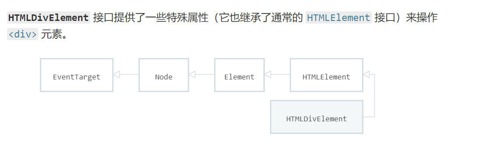

## 请列举几个HTML5语义化标签，并说说语义化有什么优点？
```
<article> 定义文章 
<aside> 定义文章的侧边栏
<figure> 一组媒体对象以及文字 
<figcaption> 定义 figure 的标题
<footer>定义页脚 
<header>定义页眉
<hgroup>定义对网页标题的组合 
<nav>定义导航
<section> 定义文档中的区段
<time>定义日期和时间
<dialog>定义一个对话框 
优点：
代码结构清晰，方便阅读，有利于团队合作开发。
方便其他设备解析（如屏幕阅读器、盲人阅读器、移动设备）以语义的方式来渲染网页。
有利于搜索引擎优化（SEO）
```
## dom中HTMLDivElement的正确继承关系是？


## HTML5新特性  
### 1.DOCTYPE声明  
```html
<!Doctype html>
```
### 2.新增的语义/结构化标签 Semantic  
<table>
<thead>
<tr>
<th>标签</th>
<th>标签</th>
</tr>
</thead>
<tbody>
<tr>
<td>&lt;article&gt;文档中定义文章内容</td>
<td>&lt;aside&gt; 元素页面主内容之外的某些内容（比如侧栏）</td>
</tr>
<tr>
<td>&lt;details&gt;描述文档或文档某个部分的细节</td>
<td>&lt;dialog&gt;定义对话框或窗口</td>
</tr>
<tr>
<td>&lt;figcaption&gt;</td>
<td>&lt;figure&gt; img和figcaption组合放在figure里</td>
</tr>
<tr>
<td>&lt;footer&gt; 一个文档可以有多个footer</td>
<td>&lt;header&gt;一个文档可以有多个header</td>
</tr>
<tr>
<td>&lt;main&gt;规定文档的主要内容</td>
<td>&lt;mark&gt;定义带有记号的文本</td>
</tr>
<tr>
<td>&lt;nav&gt; 导航</td>
<td>&lt;section&gt; 在文档中定义部分</td>
</tr>
<tr>
<td>&lt;summary&gt;包含 details 元素的标题，"details" 元素用于描述有关文档或文档片段的详细信息</td>
<td>&lt;time&gt;</td>
</tr>
</tbody>
</table>


### 3.新增的input类型和属性  
<table>
<thead>
<tr>
<th>类型type</th>
<th>属性attribute</th>
</tr>
</thead>
<tbody>
<tr>
<td>color</td>
<td>autocomplete</td>
</tr>
<tr>
<td>date</td>
<td>autofocus</td>
</tr>
<tr>
<td>datetime</td>
<td>form</td>
</tr>
<tr>
<td>datetime-local</td>
<td>formaction</td>
</tr>
<tr>
<td>email</td>
<td>formenctype</td>
</tr>
<tr>
<td>month</td>
<td>formmethod</td>
</tr>
<tr>
<td>number</td>
<td>formnovalidate</td>
</tr>
<tr>
<td>range</td>
<td>formtarget</td>
</tr>
<tr>
<td>search</td>
<td>height and width</td>
</tr>
<tr>
<td>tel</td>
<td>list</td>
</tr>
<tr>
<td>search</td>
<td>min and max</td>
</tr>
<tr>
<td>time</td>
<td>pattern(regexp)</td>
</tr>
<tr>
<td>url</td>
<td>placeholder</td>
</tr>
<tr>
<td>week</td>
<td>required</td>
</tr>
<tr>
<td>&nbsp;</td>
<td>step</td>
</tr>
<tr>
<td>&nbsp;</td>
<td>mutiple</td>
</tr>
<tr>
<td>其他</td>
<td>其他</td>
</tr>
</tbody>
</table>

### 4.新的图形标签  
SVG
代表可缩放矢量图形  
SVG用于为Web定义图形  
SVG是W3C的建议    
SVG适用于描述XML中的2D图形的语言  
Canvas随时随地绘制2D图形(使用JavaScript)  
SVG是基于XML的，这意味着每个元素在SVG DOM中都可用。你可以为每个元素添加JavaScript事件处理程序  
在SVG中，每个绘制的形状都会被记忆为一个对象。如果SVG对象的书香发生变化，浏览器可以自动重新渲染形状。  
Canvas是一像素一像素地渲染。在画布中，一旦图形绘制好了，就会被浏览器遗忘。如果你想改变某一个的位置，整个场景都需要重新绘制，包括可能已经被图形覆盖的任何对象。 
<table>
<thead>
<tr>
<th>Canvas</th>
<th>SVG</th>
</tr>
</thead>
<tbody>
<tr>
<td>与分辨率相关(可以理解为位图，图形放大会失真看到一个个像素点)</td>
<td>与分辨率无关(可以理解为矢量，图形放大不会失真)</td>
</tr>
<tr>
<td>不支持事件处理程序</td>
<td>支持事件处理程序</td>
</tr>
<tr>
<td>文字呈现功能比较简单</td>
<td>最适合具有大型渲染区域地应用程序(如Google地图)</td>
</tr>
<tr>
<td>可以将生成的图像保存为.png或.jpg</td>
<td>如果复杂地话渲染速度慢(其实任何使用DOM的东西都会很慢)</td>
</tr>
<tr>
<td>非常适合图形密集性游戏</td>
<td>不适合游戏应用程序</td>
</tr>
</tbody>
</table> 

### 5.HTML5API
HTML Geolocation 地理位置  
HTML Drag & Drop拖放  
HTML Local Storage 本地存储  
HTML Application Cache 应用程序缓存  
HTML Web Workers web工作者  
HTML SSE  

