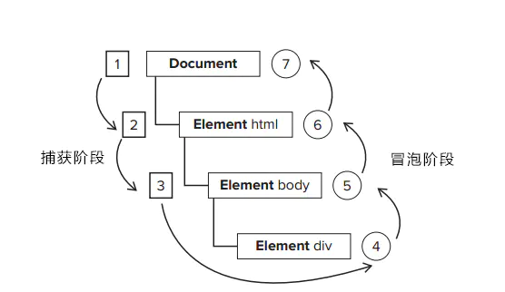

# 事件流
> 参考
> 《javascript高级程序设计》
> [掘金](https://juejin.cn/post/6844903450493321223)

**事件流描述的是从页面中接受事件的顺序**

### IE-->事件冒泡
从子元素一级级向父元素传播到document

### Netscape-->事件捕获
从document到目标元素

### DOM事件流
**事件捕获阶段、处于目标阶段、事件冒泡阶段**

在DOM事件流中，事件的目标在捕获阶段不会接受到事件。

### 事件处理程序
DOM2提供了两个方法来让我们处理和删除事件处理程序的操作：addEventListener()和removeEventListener

```js
btn.addEventListener(eventType, function () {
}, false);
 
该方法应用至dom节点
第一个参数为事件名
第二个为事件处理程序
第三个为布尔值，true为事件捕获阶段调用事件处理程序，false为事件冒泡阶段调用事件处理程序
```

测试例子
```html
<!DOCTYPE html>
<html lang="en">
<head>
    <meta charset="UTF-8">
    <title>事件冒泡</title>
</head>
<body>
    <div>
        <p id="parEle">我是父元素    <span id="sonEle">我是子元素</span></p>
    </div>
</body>
</html>
<script type="text/javascript">
var sonEle = document.getElementById('sonEle');
var parEle = document.getElementById('parEle');

parEle.addEventListener('click', function () {
    console.log('父级 冒泡');
}, false);
parEle.addEventListener('click', function () {
    console.log('父级 捕获');
}, true);

sonEle.addEventListener('click', function () {
    console.log('子级冒泡');
}, false);
sonEle.addEventListener('click', function () {
    console.log('子级捕获');
}, true);

</script>

当点击“我是子元素” 时，弹出的顺序是：“父级捕获”-->“子级冒泡”-->“子集捕获”-->“父集冒泡”；
当点击“我是父元素” 时，弹出的顺序是：“父集冒泡”-->“父级捕获”
```

### 结论
当容器元素及嵌套元素，即在`捕获阶段`又在`冒泡阶段`调用事件处理程序时：**事件按DOM事件流的顺序执行事件处理程序**  
　　且当事件处于目标阶段时，事件调用顺序决定于绑定事件的**书写顺序**，按上面的例子为，先调用冒泡阶段的事件处理程序，再调用捕获阶段的事件处理程序。依次alert出“子集冒泡”，“子集捕获”。