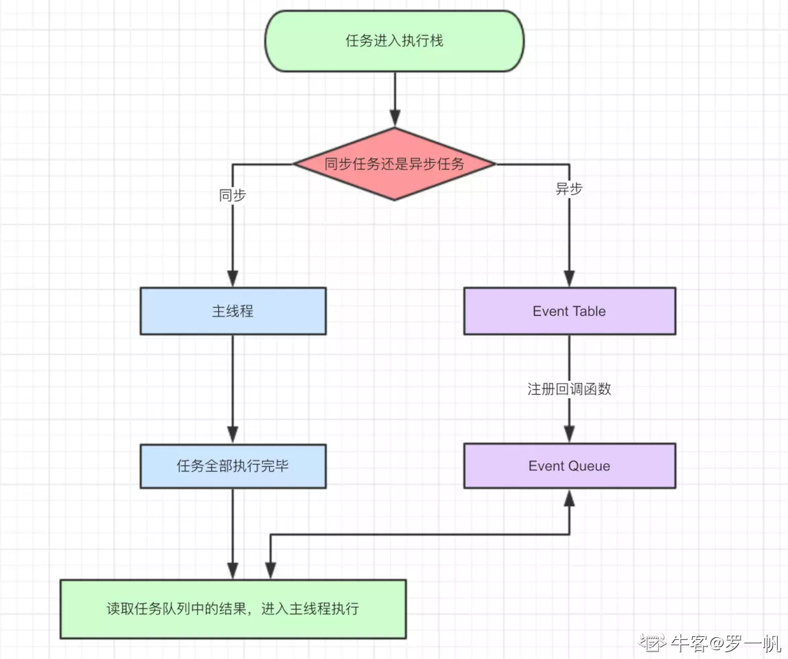
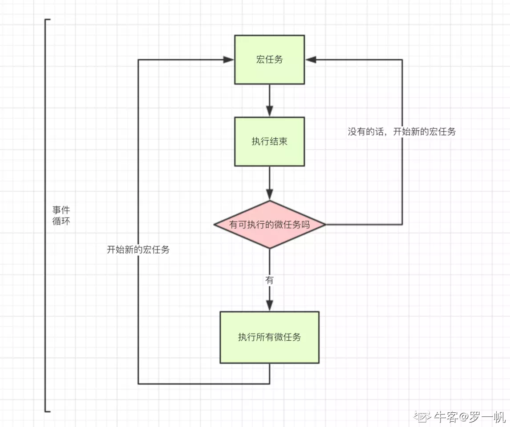

# Event Loop  
例题1，下面打印结果是？

```js
new Promise((resolve) => {
  console.log('1')
  resolve()
  console.log('2')
}).then(() => {
  console.log('3')
})
setTimeout(() => {
  console.log('4')
})
console.log('5')

//1 2 5 3 4
```
1. 首先会执行从上往下执行，Promise内部的代码也会同步执行，所以会打印1、2、5，
2. 遇到的Promise、setTimeout会放到事件队列里面，其中Promise为微任务，setTimeout为宏任务
3. 而script也是宏任务，在执行一次宏任务，之后会把满足条件的微任务执行完，然后在执行宏任务，再把满足条件的微任务执行完，直到执行完所有的微任务、宏任务
4. 因此接下来会执行Promise的then方法 打印  3
5. 执行宏任务setTimeout打印4

- js在处理异步操作时利用的是事件循环机制。事件循环机制处理顺序，**同步操作 → 异步操作(微任务 → 宏任务)**
- 由于javascript是单线程任务所以主线程只能同时处理一个任务，所以把异步的事件放在同步的事件处理完成之后再来依次处理。
  
- 异步事件又包括微任务和宏任务：  
  宏任务和微任务关系：微任务执行完后再执行宏任务  
  **微任务操作：1：Promise,2:MutationObserver**  
  **宏任务操作: 1:setTimeout,2:setInterval,3:I/O操作，4:xhr**
      
- 所以上面代码执行顺序为:
同步：console.log(1)->console.log(2)->console.log(5);  
异步：(微任务)console.log(3)->（宏任务）console.log(4);