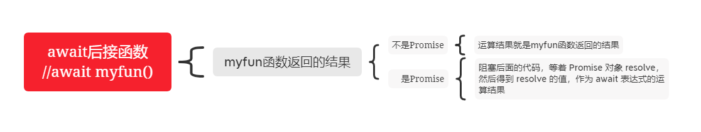
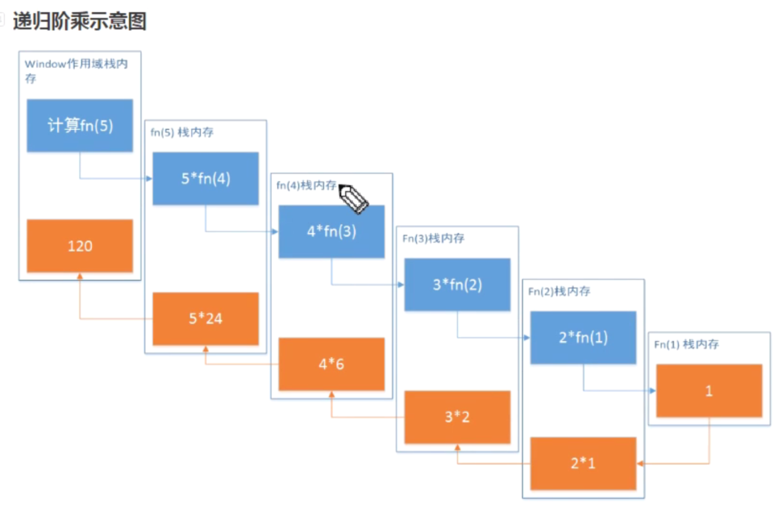

## JS总结

> 纸上得来终觉浅，绝知此事要躬行。

### 一.{} 和 [] 的 valueOf 和 toString 的结果是什么？
```
{} 的 valueOf 结果为 {} ，toString 的结果为 "[object Object]"

[] 的 valueOf 结果为 [] ，toString 的结果为 ""
```
### 二.+ 操作符什么时候用于字符串的拼接？
没遇到字符串前的+都是计算，直到遇到字符串后开始拼接

### 三.堆栈内存和闭包作用域  
[堆栈内存和闭包作用域](../BasicJSExercises/语法/堆栈内存和闭包作用域.js)  
堆：存储引用类型value的空间  
栈：执行代码的空间 所有作用域的执行环境  
    存储所有数据类型key  
    存储基本类型value  
 


### 四.alert() 输出的值都是字符串，注意这一点（严谨）  

### 五.对象（数组）的深拷贝和浅拷贝  
[对象（数组）的深拷贝和浅拷贝](../BasicJSExercises/语法/对象（数组）的深拷贝和浅拷贝.js)
#### 1. 浅拷贝  
```js
let obj = {
  a: 100,
  b: [10, 20, 30],
  c: { x: 10 },
  d:/^\d+$/
};
//浅拷贝
//多维对象/数组，只把第一层拷贝了
//1.
let obj3 = {...obj};
//2.
let obj2 = {};
for(let key in obj){
  if(!obj.hasOwnProperty(key)) break;
  obj2[key] = obj[key]
}
console.log(obj);
console.log(obj2);
console.log(obj === obj2);
obj2.c.x = 1000;
console.log(obj2.c); //{x:1000}
console.log(obj.c); // {x:1000} //这里把二维的原对象的对象里面的属性也给改了（浅拷贝）
```
  

### 六.面向对象  
[面向对象试题](../BasicJSExercises/语法/对象.js)  


### 七.new 干了什么
```js
//对于
const a = new Foo();
//new干了下面几件事
//伪代码
const o = new Object();//1.创建一个空对象
o.__proto__ = Foo.prototype;//2.让这个空对象的__proto__指向函数的原型prototype
Foo.call(o);//this指向o对象
cosnt a = o;//将o对象赋值给a对象
```

### 八.DOMContentLoaded & load  
[ DOMContentLoaded](http://www.alloyteam.com/2014/03/effect-js-css-and-img-event-of-domcontentloaded/)

### 九. == 隐式转换    
```js
// var a = ? ;
// if(a == 1 && a == 2 && a == 3){
//   console.log(1);
// }
//a是什么值时if条件为true？
```
1. == 两边数据类型不一样
   对象==字符串 对象.toString()变为字符串  
2. null == undefined相等，但是和其他值比较就不再相等了
3. NaN == NaN false 所有都false
4. 其他的都是转换为数字
   - 对象转换成数字：
     let res1 = [10].toString()  
     let result = Number('res')

### 十.call apply 区别，性能，JS实现call,apply，bind 未完成待续
fn.call(obj,10,30,40);
fn.apply(obj,[10,30,40]);
let arr = [10,30,40];
//展开运算符
fn.call(obj,...arr);
call性能好一点，特别是元素超过三个时

### 十一.js执行  
  
1.var变量声明提升（不赋值）、函数声明+赋值function fn(){let a =11;return a}  
2.代码执行  

### 十二.ES6 即ES2015新特性  
#### 1. 块级作用域   
   + let const 临时死区
#### 2. 模板字面量
   ```js
   `${name}`
   ```
#### 3. 函数
   + 默认参数=（也存在临时死区）  
   + 不定参数 展开运算符 ...args 放到最后一个参数位置
   + new Function() Function构造函数支持字符串形式参数，即参数和函数体  
   + Function.name属性获取函数实例的名称  
   + new.target判断函数是否通过new关键字调用 p55
  
   + 箭头函数 =>  
     - 没有this,super,arguments和new target绑定，**这些值由外围的最近一层非箭头函数绑定**  
     - 不能new: 没有[[Construct]]方法，不能用作构造函数
     - 没有原型，因为不能new调用，所以没有原型，没有prototype
     - 不可以改变this的绑定
       箭头函数的this值取决于该函数作用域链最近一层外部非箭头函数的this值，不能通过call(),apply(),bind()方法改变this值
       [es5转es6this改变](../BasicJSExercises/语法/es6Toes5.js)
#### 4. 对象  
    + 对象字面量语法扩展 
     属性初始值 对象方法 简写  
     简写方法注意：可以使用super；他有一个name属性
     ```js
     var person = {
       name:"Nicholas"
       sayName(){
         console.log(this.name) //这里的this.name是"sayName"，不是"Nicholas"
       }
     }
     ```
    + Object.is()
     如果这两个参数类型相同且具有相同的值，则返回true  
     ```js
     //全等运算符===比较的确定
     +0 === -0 //true 实际上这两个在js引擎中被表示为两个完全不同的实体
     NaN === NaN //flase 要用isNaN()才可以正确检测
    
     //
     Object.is(+0,-0);//false
     Object.is(NaN,NaN);//true
     ```
   + Object.assign()

    混合（Mixin)是js实现对象组合的模式  
    在一个minxin方法中，一个对象接收来自另一个对象的属性和方法  
    Object.assign(receiver,supplier) supplier可以有很多个，返回值：接收对象  
    Object.assign()方法接收任意多个原对象，并按指定顺序将属性复制到接收对象中。如果supperier中属性同名，后面覆盖前面的  
    Object.assign()的supplier不能是访问器属性，因为Object.assign()提供了赋值操作，supperier的访问器属性会鞭策receiver的数据属性  
    Object.assign只拷贝自身属性，不可枚举的属性（enumerable为false）和继承的属性不会被拷贝，是浅拷贝。  

   + 重复的对象字面量选取最后一个取值
   + 自有属性枚举顺序，

    针对Object.getOwnPropertyNames()和Reflect.ownKeys有其枚举顺序：
    - 数字升序
    - 字符串、symbol按加入对象顺序  
  针对Object.keys()、for-in、JSON.stringify()枚举顺序不明确  
   + Object.setPrototypeOf()  

    改变指定对象的原型
    参数：第一个：被改变原型的对象
         第二个：替代第一个参数原型的对象
    实际上操作[[Prototype]]
   + super

    super引用相当于指向对象原型的指针，即Object.getPrototypeOf(this)的值  
    **必须在对象字面量的简写方法中使用**
#### 5. 解构
   + 对象
   + 数组
   + 默认值 = 
   + 嵌套解构
#### 6. Symbol 
   Symbol实例是唯一的，不可变的  
   作用：确保对象属性使用唯一标识符，不会发生属性冲突  
   Symbol.for() 共享
   Symbol.keyFor() 检索
#### 7. Set Map
#### 8. 迭代器 生成器
   + 迭代器 
     - next()方法返回一个对象 
       如：{value：1，done:false}  
           {value:undefined,done:true}
       value：下一个要返回的值，done:没有更多返回值时就是true  
   + 生成器
     ```js
     function *createIterator(){
       yield 1;
       yield 2;
       yield 3;
     }
     let iterator = createIterator();
     console.log(iterator.next().value); //1
     console.log(iterator.next().value); //2
     console.log(iterator.next().value); //3
     ```
  + for-of  
    for-of的遍历会调用可迭代对象的next()方法，并将迭代器返回的结果对象的value属性存储在一个变量中，循环执行直到done:true
#### 9. 类
#### 10. 改进的数组功能
#### 11. Promise
#### 12. 代理（Proxy） 反射（Reflection)
#### 13. 模块化

### 十三.ES8 即ES2017
#### 1. async/await  
[async/await](../BasicJSExercises/语法/asyncawait.js)
[参考](https://segmentfault.com/a/1190000007535316)
##### 理解async/await
- 1. 先来看下它的执行顺序  
```js
async function async1() {
  console.log( 'async1 start' )
  await async2()
  console.log( 'async1 end' )
}

function async2() {
  console.log( 'async2' )
}

async1()

console.log( 'script start' )
```

- 2. 概念  
async 用于申明一个 function 是异步的，而 await 用于等待一个异步方法执行完成  
await 只能出现在 async 函数中  


- 3. async的作用  
3.1 处理返回值将直接输出一个fullfill状态的Promise  
如果在函数中 return 一个直接量，async 会把这个直接量通过` Promise.resolve() `封装成 Promise 对象。  
```js
async function testAsync() {
  return "hello async"
}
const res = testAsync()
console.log(res)   //Promise { 'hello async' }
```

如果没有返回值  
```js
async function testAsync2() {}
const res = testAsync2()
console.log(res)  //Promise { undefined }
```
联想一下 Promise 的特点——无等待，所以`在没有 await 的情况下执行 async 函数，它会立即执行`，返回一个 Promise 对象，并且，绝`不会阻塞后面的语句`。这和普通返回 Promise 对象的函数并无二致。  

- 4. await 到底在等啥  
await 等待的的是一个表达式，这个表达式的计算结果是 Promise 对象或者其它值，即`没有特殊限定`  
所以，await 后面实际是可以接普通函数调用或者直接量的  
```js
function getSomething() {
    return "something";
}

async function testAsync() {
    return Promise.resolve("hello async");
}

async function test() {
    const v1 = await getSomething();
    const v2 = await testAsync();
    console.log(v1, v2); //v1 v2都可以被打印出来
}

test();
```
- 5. await等到了之后（await后面接了表达式之后）
**如果它等到的不是一个 Promise 对象，那 await 表达式的运算结果就是它等到的东西。**    
**如果它等到的是一个 Promise 对象，await 就忙起来了，它会阻塞后面的代码，等着 Promise 对象 resolve，然后得到 resolve 的值，作为 await 表达式的运算结果。**   
 
##### 应用async/await  

上面已经说明了**async 会将其后的函数（函数表达式或 Lambda）的返回值封装成一个 Promise 对象，而 await 会等待这个 Promise 完成，并将其 resolve 的结果返回出来。**  
- 1. 简单比较  
异步操作，用`setTimeout`模拟：  
不用async/await  
```js
function takeLongTime() {
    return new Promise(resolve => {
        setTimeout(() => resolve("long_time_value"), 1000);
    });
}

takeLongTime().then(v => {
    console.log("got", v);
});
```
使用async/await  
```js
function takeLongTime() {
    return new Promise(resolve => {
        setTimeout(() => resolve("long_time_value"), 1000);
    });
}

async function test() {
    const v = await takeLongTime();
    console.log(v);
}

test();
```
**`结果`:差别不明显**
- 2. async/await 的优势在于处理 then 链
+ 业务一  
假设一个业务，分多个步骤完成，每个步骤都是异步的，而且依赖于上一个步骤的结果。我们仍然用 setTimeout 来模拟异步操作  
```js
/**
 * 传入参数 n，表示这个函数执行的时间（毫秒）
 * 执行的结果是 n + 200，这个值将用于下一步骤
 */
function takeLongTime(n) {
    return new Promise(resolve => {
        setTimeout(() => resolve(n + 200), n);
    });
}

function step1(n) {
    console.log(`step1 with ${n}`);
    return takeLongTime(n);
}

function step2(n) {
    console.log(`step2 with ${n}`);
    return takeLongTime(n);
}

function step3(n) {
    console.log(`step3 with ${n}`);
    return takeLongTime(n);
}
```
使用Promise处理 
```js
function doIt() {
    console.time("doIt");
    const time1 = 300;
    step1(time1)
        .then(time2 => step2(time2))
        .then(time3 => step3(time3))
        .then(result => {
            console.log(`result is ${result}`);
            console.timeEnd("doIt");
        });
}

doIt();

// c:\var\test>node --harmony_async_await .
// step1 with 300
// step2 with 500
// step3 with 700
// result is 900
// doIt: 1507.251ms
```
async/await处理
```js
async function doIt() {
    console.time("doIt");
    const time1 = 300;
    const time2 = await step1(time1);
    const time3 = await step2(time2);
    const result = await step3(time3);
    console.log(`result is ${result}`);
    console.timeEnd("doIt");
}

doIt();
```
+ 修改业务
仍然是三个步骤，但每一个步骤都需要之前每个步骤的结果  
```js
function step1(n) {
    console.log(`step1 with ${n}`);
    return takeLongTime(n);
}

function step2(m, n) {
    console.log(`step2 with ${m} and ${n}`);
    return takeLongTime(m + n);
}

function step3(k, m, n) {
    console.log(`step3 with ${k}, ${m} and ${n}`);
    return takeLongTime(k + m + n);
}
```
async/await写法
```js
async function doIt() {
    console.time("doIt");
    const time1 = 300;
    const time2 = await step1(time1);
    const time3 = await step2(time1, time2);
    const result = await step3(time1, time2, time3);
    console.log(`result is ${result}`);
    console.timeEnd("doIt");
}

doIt();

// c:\var\test>node --harmony_async_await .
// step1 with 300
// step2 with 800 = 300 + 500
// step3 with 1800 = 300 + 500 + 1000
// result is 2000
// doIt: 2907.387ms
```
pormise写法
```js
function doIt() {
    console.time("doIt");
    const time1 = 300;
    step1(time1)
        .then(time2 => {
            return step2(time1, time2)
                .then(time3 => [time1, time2, time3]);
        })
        .then(times => {
            const [time1, time2, time3] = times;
            return step3(time1, time2, time3);
        })
        .then(result => {
            console.log(`result is ${result}`);
            console.timeEnd("doIt");
        });
}

doIt();
```
##### Promise reject的情况
[参考](http://www.ruanyifeng.com/blog/2015/05/async.html)
await 命令后面的 Promise 对象，运行结果可能是 rejected，所以最好把 await 命令放在 try...catch 代码块中  
```js
async function myFunction() {
  try {
    await somethingThatReturnsAPromise();
  } catch (err) {
    console.log(err);
  }
}

// 另一种写法

async function myFunction() {
  await somethingThatReturnsAPromise().catch(function (err){
    console.log(err);
  });
}
```


### 十四. ES10 即ES2019
#### 1. Bigint 基本数据类型  
可以用任意精度表示整数，安全存储和操作大整数甚至超过甚至可以超过数字的安全整数限制。BigInt是通过在整数末尾附加 n 或调用构造函数来创建的。  
通过使用常量Number.MAX_SAFE_INTEGER，您可以获得可以用数字递增的最安全的值。通过引入 BigInt，您可以操作超过Number.MAX_SAFE_INTEGER的数字。您可以在下面的示例中观察到这一点，其中递增Number.MAX_SAFE_INTEGER会返回预期的结果  
```js
const x = 2n ** 53n;
9007199254740992n
const y = x + 1n; 
9007199254740993n
```
可以对BigInt使用运算符+、*、-、**和%，就像对数字一样。BigInt 严格来说并不等于一个数字，但它是松散的。  
在将BigInt转换为Boolean时，它的行为类似于一个数字：if、||、&&、Boolean 和!。  
BigInt不能与数字互换操作。否则，将抛出TypeError。  

### 十五.函数防抖（debounce) 节流(throttling)
当绑定一些持续触发的事件时，如resize(文档视图调整大小时触发）、scroll、mousemove  
不希望事件持续触发的过程中那么频繁地去执行函数  

+ 事件持续触发过程中频繁执行函数  
```html
<div id="content" style="height:150px;line-height:150px;text-align:center; color: #fff;background-color:#ccc;font-size:80px;"></div>
<script>
    let num = 1;
    let content = document.getElementById('content');

    function count(){
      content.innerHTML = num++;
    };

    content.onmousemove = count;
</script>
```

+ 防抖（debounce）
  控制次数  
  **触发事件后在n秒内函数只能执行一次，如果n秒内又触发了事件，则会重新计算函数的执行时间** 
  ```js
  //非立即执行版：
  //非立即执行版的意思是触发事件后函数不会立即执行，而是在 n 秒后执行，如果在 n 秒内又触发了事件，则会重新计算函数执行时间。
  function debounce(func,wait){
    let timeout;
    return function(){
      let context = this;
      let args = arguments;

      if(timeout) clearTimeout(timeout);

      timeout = setTimeout(()=>{
        func.apply(context,args)
      },wait)
    }
  }
  ```

+ 节流（throttle)
  控制频率  
  **连续触发事件但是在n秒中只执行一次函数。稀释函数的执行频率** 

### 十六.Event Loop  
[头条EventLoop](../BasicJSExercises/语法/EventLoop.js)  


### 十七.异步编程  未完待续
[参考阮一峰老师《深入掌握 ECMAScript 6 异步编程》](http://www.ruanyifeng.com/blog/2015/04/generator.html)
旧方法：
>1.回调函数  
>2.事件监听  
>3.发布订阅  
>4.Promise对象

- 异步是什么？  
简单说就是一个任务分成两段，先执行第一段，然后转而执行其他任务，等做好了准备，再回过头执行第二段。  
#### 回调函数
例子：  
你到一个商店买东西，刚好你要的东西没有货，于是你在店员那里留下了你的电话，过了几天店里有货了，店员就打了你的电话，然后你接到电话后就到店里去取了货。  
在这个例子里，你的电话号码就叫`回调函数`，你把电话留给店员就叫`登记回调函数`，店里后来有货了叫做`触发回调事件`，店员给你打电话叫做`调用回调函数`，你到店里去取货叫做`响应回调事件`。  
**就是把任务的第二段单独写在一个函数里面，等到重新执行这个任务的时候，就直接调用这个函数**
例子：读取文件
```js
fs.readFile('/etc/passwd', function (err, data) {
  if (err) throw err;
  console.log(data);
});
```
上面代码中，readFile 函数的第二个参数，就是回调函数，也就是任务的第二段。等到操作系统返回了 /etc/passwd 这个文件以后，回调函数才会执行。  
为什么 Node.js 约定，回调函数的第一个参数，必须是错误对象err（如果没有错误，该参数就是 null）？   
原因是执行分成两段，在这两段之间抛出的错误，程序无法捕捉，只能当作参数，传入第二段。  
即**第二段的err对象为这两段之间抛出的错误**

### 十八.懒加载
移动端有懒加载，错误图片可用这个
```html

```

### 十九.客户端存储
#### 客户端储存方案
- 服务端储存
  - 服务端文件储存
  - 内存
  - 数据库：mysql、mongoodb、Oracle等等。
- 客户端储存(离线储存)
  - 浏览器

#### 1. cookie  
- cookie是http协议下，服务端或者脚本可以维护客户端信息的一种方式。  
- `koa`中cookie的使用  
  - 储存cookie的值；
  ```js
  ctx.cookies.set(name, value, [options])
  ```
  - 获取cookie的值
  ```js
  ctx.cookies.get(name, [options])
  ```

  - options常用设置
    - `maxAge` 一个数字表示从 Date.now() 得到的毫秒数
    - `expires` cookie 过期的 `Date`
    - `path` cookie 路径, 默认是`'/'`
    - `domain` cookie 域名
    - `secure` 安全 cookie  设置后只能通过https来传递cookie
    - `httpOnly` 服务器可访问 cookie, 默认是 **true**
    - `overwrite` 一个布尔值，表示是否覆盖以前设置的同名的 cookie (默认是 **false**). 如果是 true,` 在同一个请求中设置相同名称的所有 Cookie
- `客户端`cookie使用方式；
  - 设置
    ```js
    document.cookie="key=value"
    ```
    - key和value是包含在一个字符串中
      - key包含字段
        - [name] 这个name为自己取的cookie名称，同名的值会覆盖
        - domain 所属域名
        - path 所属路径
        - Expires/Max-Age 到期时间/持续时间 (单位是秒)
        - http-only 是否只作为http时使用，如果为true，那么客户端能够在http请求和响应中进行传输，但时客户端浏览器不能使用js去读取或修改
    - 多个key=value使用 ; （分号）分隔

  - 获取  
    ```js
    document.cookie  
    ```
    返回值是当前域名下的所有cookie，并按照某种格式组织的字符串 ：  key=value;key1=value1;......keyn=valuen  
所以使用时最好封装一下
    ```js
    //设置cookie
    function setCookie(name,value,options={}){
        let cookieData = `${name}=${value};`;
        for(let key in options){
            let str = `${key}=${options[key]};`;
            cookieData += str;
        }
        document.cookie = cookieData;
    }
    ```

    

    - 获取cookie

    ```js
    //获取Cookie
    function getCookie(name){
        let arr = document.cookie.split("; ");
        for(let i=0;i<arr.length;i++){
            let items = arr[i].split("=");
            if(items[0]==name){
                return items[1];
            }
        }
        return "";
    }
    ```
#### 2. 本地缓存Storage

- localStorage及sessionStorage使用

  - 设置

    setItem(key, value)   添加或更新（如果数据项中已存在该key）数据项中指定key的value

  - 获取

    getItem(key) 获取数据项中指定key对应的value

  - 移出指定数据

    removeItem(key) 删除数据项中指定key的value

  - 清空所有数据

    clear()  清空所有数据项

#### **本地存储异同**

- 共同点

- localStorage和sessionStorage和cookie共同点
  - 同域（同源策略）限制：同源策略：请求与响应的 协议、域名、端口都相同 则时同源，否则为 跨源/跨域
  - 存储的内容都会转为字符串格式
  - 都有存储大小限制

- localStorage和sessionStorage共同点

  - API相同
  - 存储大小限制一样基本类似
  - 无个数限制

  

- 不同点
- localStorage
  - 没有有效期，除非删除，否则一直存在
  - 同域下页面共享
  - 支持 storage 事件
- sessionStorage
  - 浏览器关闭，自动销毁
  - 页面私有
  - 不支持 storage 事件

- cookie
  - 浏览器也会在每次请求的时候主动组织所有域下的cookie到请求头 cookie 中，发送给服务器端
  - 浏览器会主动存储接收到的 set-cookie 头信息的值
  - 可以设置 http-only 属性为 true 来禁止客户端代码（js）修改该值
  - 可以设置有效期 (默认浏览器关闭自动销毁)(不同浏览器有所不同)
  - 同域下个数有限制，最好不要超过50个(不同浏览器有所不同)
  - 单个cookie内容大小有限制，最好不要超过4000字节(不同浏览器有所不同)

### 二十.递归
// 注意面试回答要深入
- 一个函数在**内部调用其本身**，则该函数为递归函数
- 递归函数一定要有**跳出条件**，否则就会形成死循环
- **最先调用栈内存的最后结束，最后调用栈内存的最先结束**



