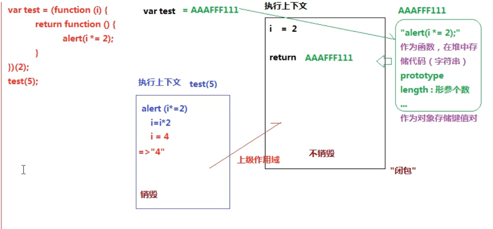
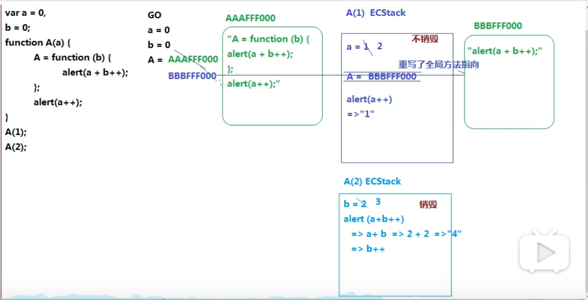
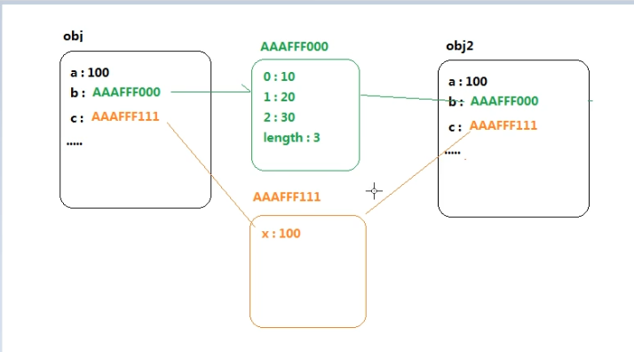
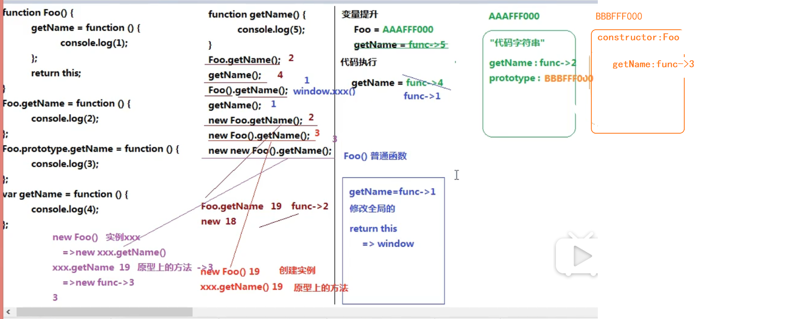
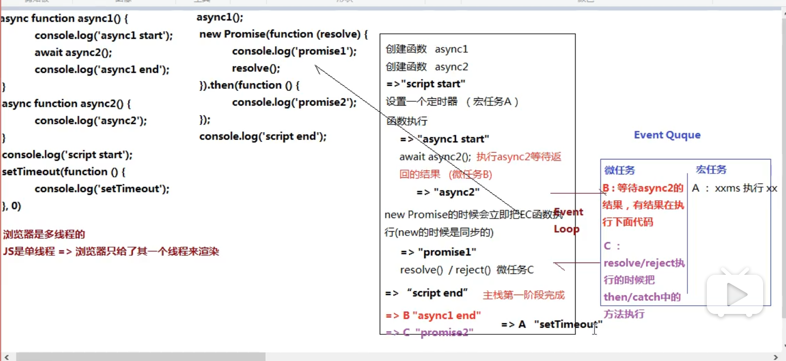

部分参考自[GitHUb开源项目](https://github.com/CavsZhouyou/Front-End-Interview-Notebook/blob/master/JavaScript/JavaScript.md)，一些收藏和其他想法
### 1.{} 和 [] 的 valueOf 和 toString 的结果是什么？
```
{} 的 valueOf 结果为 {} ，toString 的结果为 "[object Object]"

[] 的 valueOf 结果为 [] ，toString 的结果为 ""
```
### 2.+ 操作符什么时候用于字符串的拼接？
没遇到字符串前的+都是计算，直到遇到字符串后开始拼接

### 3.堆栈内存和闭包作用域  
[堆栈内存和闭包作用域](../BasicJSExercises/语法/堆栈内存和闭包作用域.js)
堆：存储引用类型值的空间  
栈：存储基本类型值和执行代码的空间 
 


### 4.alert() 输出的值都是字符串，注意这一点（严谨）  

### 5.对象（数组）的深克隆和浅克隆  
[对象（数组）的深克隆和浅克隆](../BasicJSExercises/语法/对象（数组）的深克隆和浅克隆.js)
#### 浅克隆  
```js
let obj = {
  a: 100,
  b: [10, 20, 30],
  c: { x: 10 },
  d:/^\d+$/
};
//浅克隆
//多维对象/数组，只把第一层克隆了
//1.
let obj3 = {...obj};
//2.
let obj2 = {};
for(let key in obj){
  if(!obj.hasOwnProperty(key)) break;
  obj2[key] = obj[key]
}
console.log(obj);
console.log(obj2);
console.log(obj === obj2);
obj2.c.x = 1000;
console.log(obj2.c); //{x:1000}
console.log(obj.c); // {x:1000} //这里把二维的原对象的对象里面的属性也给改了（浅克隆）
```
  

### 面向对象试题  
[面向对象试题](../BasicJSExercises/语法/对象.js)  


### Event Loop  
[头条EventLoop](../BasicJSExercises/语法/EventLoop.js)  


### new 干了什么
```js
//对于
const a = new Foo();
//new干了下面几件事
//伪代码
const o = new Object();//1.创建一个空对象
o.__proto__ = Foo.prototype;//2.让这个空对象的__proto__指向函数的原型prototype
Foo.call(o);//this指向o对象
cosnt a = o;//将o对象赋值给a对象
```

###  DOMContentLoaded & load  
[ DOMContentLoaded](http://www.alloyteam.com/2014/03/effect-js-css-and-img-event-of-domcontentloaded/)

### == 隐式转换    
```js
// var a = ? ;
// if(a == 1 && a == 2 && a == 3){
//   console.log(1);
// }
//a是什么值时if条件为true？
```
1. == 两边数据类型不一样
   对象==字符串 对象.toString()变为字符串  
2. null == undefined相等，但是和其他值比较就不再相等了
3. NaN == NaN false 所有都false
4. 其他的都是转换为数字
   - 对象转换成数字：
     let res1 = [10].toString()  
     let result = Number('res')

### call apply 区别，性能
fn.call(obj,10,30,40);
fn.apply(obj,[10,30,40]);
let arr = [10,30,40];
//展开运算符
fn.call(obj,...arr);
call性能好一点，特别是元素超过三个时

### js执行  
  
1.var变量声明提升（不赋值）、函数声明+赋值function fn(){let a =11;return a}  
2.代码执行  

### ES6新特性  
1. 块级作用域   
   + let const 临时死区
2. 模板字面量
   ```js
   `${name}`
   ```
3. 函数
   + 默认参数=（也存在临时死区）  
   + 不定参数 展开运算符 ...args 放到最后一个参数位置
   + new Function() Function构造函数支持字符串形式参数，即参数和函数体  
   + Function.name属性获取函数实例的名称  
   + new.target判断函数是否通过new关键字调用 p55
  
   + 箭头函数 =>  
     - 没有this,super,arguments和new target绑定，**这些值由外围的最近一层非箭头函数绑定**  
     - 不能new: 没有[[Construct]]方法，不能用作构造函数
     - 没有原型，因为不能new调用，所以没有原型，没有prototype
     - 不可以改变this的绑定
       箭头函数的this值取决于该函数作用域链最近一层外部非箭头函数的this值，不能通过call(),apply(),bind()方法改变this值
       [es5转es6this改变](../BasicJSExercises/语法/es6Toes5.js)
4. 对象  
    + 对象字面量语法扩展 
     属性初始值 对象方法 简写  
     简写方法注意：可以使用super；他有一个name属性
     ```js
     var person = {
       name:"Nicholas"
       sayName(){
         console.log(this.name) //这里的this.name是"sayName"，不是"Nicholas"
       }
     }
     ```
    + Object.is()
     如果这两个参数类型相同且具有相同的值，则返回true  
     ```js
     //全等运算符===比较的确定
     +0 === -0 //true 实际上这两个在js引擎中被表示为两个完全不同的实体
     NaN === NaN //flase 要用isNaN()才可以正确检测

     //
     Object.is(+0,-0);//false
     Object.is(NaN,NaN);//true
     ```
   + Object.assign()
    混合（Mixin)是js实现对象组合的模式  
    在一个minxin方法中，一个对象接收来自另一个对象的属性和方法  
    Object.assign(receiver,supplier) supplier可以有很多个，返回值：接收对象  
    Object.assign()方法接收任意多个原对象，并按指定顺序将属性复制到接收对象中。如果supperier中属性同名，后面覆盖前面的  
    Object.assign()的supplier不能是访问器属性，因为Object.assign()提供了赋值操作，supperier的访问器属性会鞭策receiver的数据属性  
    Object.assign只拷贝自身属性，不可枚举的属性（enumerable为false）和继承的属性不会被拷贝，是浅拷贝。  

   + 重复的对象字面量选取最后一个取值
   + 自有属性枚举顺序，
    针对Object.getOwnPropertyNames()和Reflect.ownKeys有其枚举顺序：
    - 数字升序
    - 字符串、symbol按加入对象顺序  
  针对Object.keys()、for-in、JSON.stringify()枚举顺序不明确  
   + Object.setPrototypeOf()  
    改变指定对象的原型
    参数：第一个：被改变原型的对象
         第二个：替代第一个参数原型的对象
    实际上操作[[Prototype]]
   + super
    super引用相当于指向对象原型的指针，即Object.getPrototypeOf(this)的值  
    **必须在对象字面量的简写方法中使用**
5. 解构
   + 对象
   + 数组
   + 默认值 = 
   + 嵌套解构
6. Symbol 
   Symbol实例是唯一的，不可变的  
   作用：确保对象属性使用唯一标识符，不会发生属性冲突  
   Symbol.for() 共享
   Symbol.keyFor() 检索
7. Set Map
8. 迭代器 生成器
   + 迭代器 
     - next()方法返回一个对象 
       如：{value：1，done:false}  
           {value:undefined,done:true}
       value：下一个要返回的值，done:没有更多返回值时就是true  
   + 生成器
     ```js
     function *createIterator(){
       yield 1;
       yield 2;
       yield 3;
     }
     let iterator = createIterator();
     console.log(iterator.next().value); //1
     console.log(iterator.next().value); //2
     console.log(iterator.next().value); //3
     ```
  + for-of  
    for-of的遍历会调用可迭代对象的next()方法，并将迭代器返回的结果对象的value属性存储在一个变量中，循环执行直到done:true
9. 类
10. 改进的数组功能
11. Promise
12. 代理（Proxy） 反射（Reflection)
13. 模块化
  
### 函数防抖（debounce) 节流(throttling)
当绑定一些持续触发的事件时，如resize(文档视图调整大小时触发）、scroll、mousemove  
不希望事件持续触发的过程中那么频繁地去执行函数  

+ 事件持续触发过程中频繁执行函数  
```html
<div id="content" style="height:150px;line-height:150px;text-align:center; color: #fff;background-color:#ccc;font-size:80px;"></div>
<script>
    let num = 1;
    let content = document.getElementById('content');

    function count(){
      content.innerHTML = num++;
    };

    content.onmousemove = count;
</script>
```

+ 防抖（debounce）
  控制次数  
  **触发事件后在n秒内函数只能执行一次，如果n秒内又触发了事件，则会重新计算函数的执行时间** 
  ```js
  //非立即执行版：
  //非立即执行版的意思是触发事件后函数不会立即执行，而是在 n 秒后执行，如果在 n 秒内又触发了事件，则会重新计算函数执行时间。
  function debounce(func,wait){
    let timeout;
    return function(){
      let context = this;
      let args = arguments;

      if(timeout) clearTimeout(timeout);

      timeout = setTimeout(()=>{
        func.apply(context,args)
      },wait)
    }
  }
  ``` 

+ 节流（throttle)
  控制频率  
  **连续触发事件但是在n秒中只执行一次函数。稀释函数的执行频率** 


