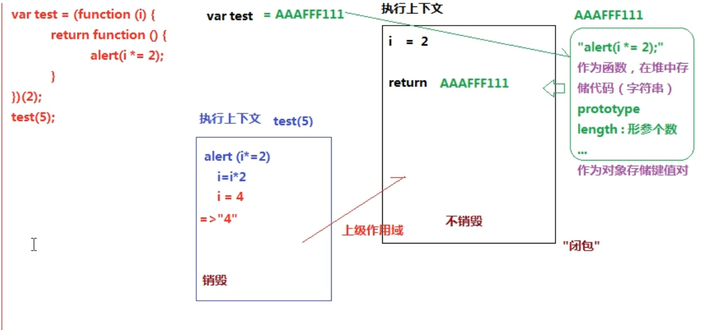
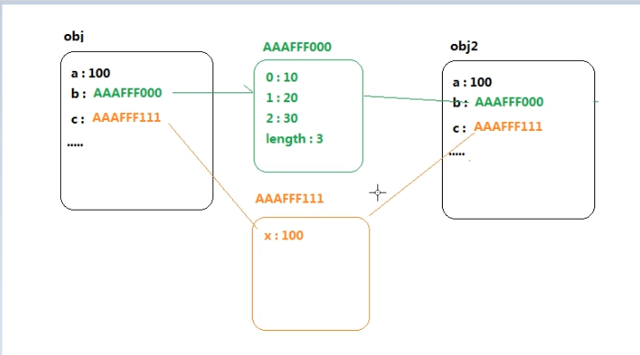
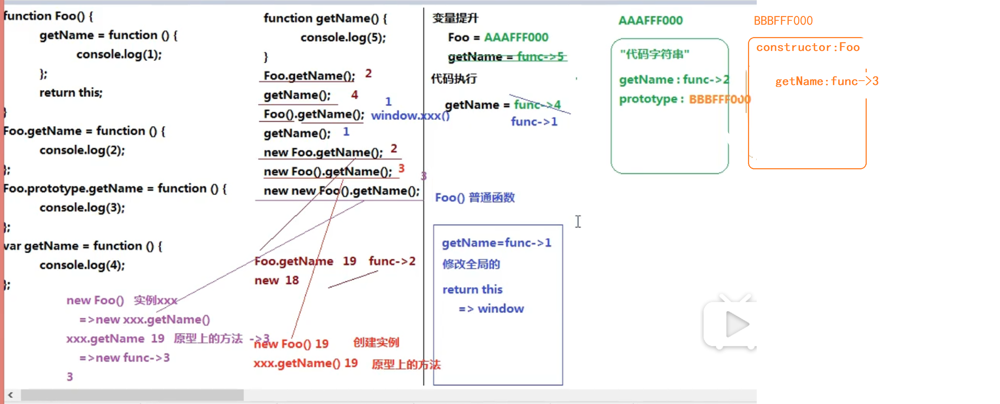

部分参考自[GitHUb开源项目](https://github.com/CavsZhouyou/Front-End-Interview-Notebook/blob/master/JavaScript/JavaScript.md)，一些收藏和其他想法
### 1.{} 和 [] 的 valueOf 和 toString 的结果是什么？
```
{} 的 valueOf 结果为 {} ，toString 的结果为 "[object Object]"

[] 的 valueOf 结果为 [] ，toString 的结果为 ""
```
### 2.+ 操作符什么时候用于字符串的拼接？
没遇到字符串前的+都是计算，直到遇到字符串后开始拼接

### 3.堆栈内存和闭包作用域  
[堆栈内存和闭包作用域](../BasicJSExercises/堆栈内存和闭包作用域.js)
堆：存储引用类型值的空间  
栈：存储基本类型值和执行代码的空间 
 


### 4.alert() 输出的值都是字符串，注意这一点（严谨）  

### 5.对象（数组）的深克隆和浅克隆  
[对象（数组）的深克隆和浅克隆](../BasicJSExercises/对象（数组）的深克隆和浅克隆.js)
#### 浅克隆  
```js
let obj = {
  a: 100,
  b: [10, 20, 30],
  c: { x: 10 },
  d:/^\d+$/
};
//浅克隆
//多维对象/数组，只把第一层克隆了
//1.
let obj3 = {...obj};
//2.
let obj2 = {};
for(let key in obj){
  if(!obj.hasOwnProperty(key)) break;
  obj2[key] = obj[key]
}
console.log(obj);
console.log(obj2);
console.log(obj === obj2);
obj2.c.x = 1000;
console.log(obj2.c); //{x:1000}
console.log(obj.c); // {x:1000} //这里把二维的原对象的对象里面的属性也给改了（浅克隆）
```
  

### 面向对象试题  
[面向对象试题](../BasicJSExercises/面向对象.js)  


