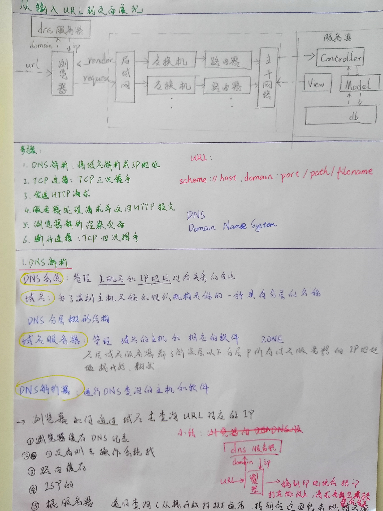
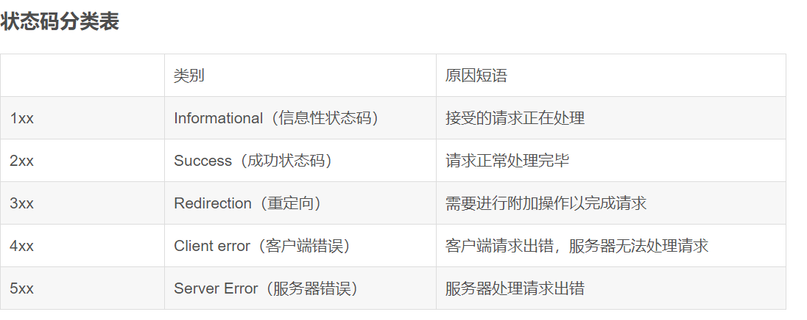
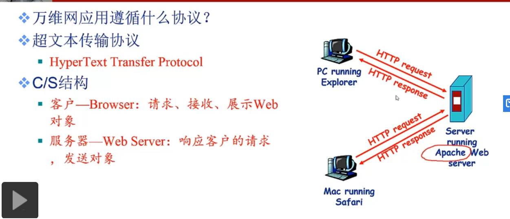

## 从输入URL到显示页面发生了什么？ 

待补充：第5点，关键路径、阻塞
第6点，为什么4次握手

## http 状态码  

常见的  
- 2xx  
- 200 OK   client->server request 正常处理并返回
- 204 No Content    client->server request成功处理，但响应报文中不含实体的主体部分（没有资源可以返回）  
- 206 Partial Content    client进行了范围请求，server成果执行了这部分GET，响应报文包含由Content-Range指定范围的实体内容  
- 3xx  
- 301 Moved Permanently：永久性重定向，表示请求的资源被分配了新的URL，之后应使用更改的URL；
- 302 Found：临时性重定向，表示请求的资源被分配了新的URL，希望本次访问使用新的URL；
       301与302的区别：前者是永久移动，后者是临时移动（之后可能还会更改URL）
- 303 See Other：表示请求的资源被分配了新的URL，应使用GET方法定向获取请求的资源；
      302与303的区别：后者明确表示客户端应当采用GET方式获取资源
- 304 Not Modified：表示客户端发送附带条件（是指采用GET方法的请求报文中包含if-Match、If-Modified-Since、If-None-Match、If-Range、    If-Unmodified-Since中任一首部）的请求时，服务器端允许访问资源，但是请求为满足条件的情况下返回改状态码；
- 307 Temporary Redirect：临时重定向，与303有着相同的含义，307会遵照浏览器标准不会从POST变成GET；（不同浏览器可能会出现不同的情况）；
- 4xx （4种）
- 400 Bad Request：表示请求报文中存在语法错误；
- 401 Unauthorized：未经许可，需要通过HTTP认证；
- 403 Forbidden：服务器拒绝该次访问（访问权限出现问题）
- 404 Not Found：表示服务器上无法找到请求的资源，除此之外，也可以在服务器拒绝请求但不想给拒绝原因时使用；
- 5xx （2种）
- 500 Inter Server Error：表示服务器在执行请求时发生了错误，也有可能是web应用存在的bug或某些临时的错误时；
- 503 Server Unavailable：表示服务器暂时处于超负载或正在进行停机维护，无法处理请求；

## 网络攻击  
### 针对Web应用的攻击模式  
- 以服务器为目标的主动攻击 
- - SQL注入
- - OS命令注入  
- 以服务器为目标的被动攻击 
- - 跨站脚本攻击XSS
- - 跨站请求伪造CSRF
- - HTTP首部注入攻击 HTTP Header Injection
常见  
+ 跨站脚本攻击XSS Cross-Site Scripting  
  通过存在安全漏洞的Web网站注册用户的浏览器运行非法的HTML或JavaScript进行的一种攻击  
  影响：利用虚假的输入表单骗取用户个人信息
       利用脚本窃取用户Cookie值，被害者在不知情的情况下，帮助攻击者发送恶意请求  
       显示伪造的文章或图片

+ SQL注入攻击SQL Injection  
  针对数据库，运行非法SQL  
  影响：非法查看或篡改数据库的数据  
       规避认证  
       执行和数据库业务关联的程序   

+ OS命令注入攻击OS Command Injection    
  通过Web应用，执行非法的操作系统命令，在能调用Shell函数的地方就存在风险  

+ HTTP首部注入攻击 HTTP Header Injection
  攻击者通过在响应首部字段内插入换行，添加响应首部或主体的一种攻击
  HTTP响应截断攻击（HTTP Response Splitting Attack）：向首部主体内添加内容的攻击
  影响：设置任何Cookie信息
        重定向至任何URL
        显示任意的主体（HTTP响应截断攻击）
        
+ 跨站点请求伪造CSRF  Cross-Site Request Forgeries  
  攻击者通过设置好的陷阱，强制对已完成认证的用户进行非预期的个人信息或设定信息等某些状态更新
  影响：利用已通过认证的用户权限更新设定信息，购买商品，在留言板上发表言论  

+ 分布式拒绝服务攻击DDoS Distributed Denial of Service  
  处于不同位置的多个攻击者同时向一个或数个目标发动攻击，或者一个攻击者控制了位于不同位置的多台机器并利用这些机器对受害者同时实施攻击。由于攻击的发出点是分布在不同地方的，这类攻击称为分布式拒绝服务攻击，其中的攻击者可以有多个

+ DNS欺骗攻击
   DNS欺骗就是攻击者冒充域名服务器的一种欺骗行为。 原理：如果可以冒充域名服务器，然后把查询的IP地址设为攻击者的IP地址，这样的话，用户上网就只能看到攻击者的主页，而不是用户想要取得的网站的主页了，这就是DNS欺骗的基本原理。DNS欺骗其实并不是真的“黑掉”了对方的网站，而是冒名顶替、招摇撞骗罢了

+ SYN Flooding攻击  
  Synflooding（同步泛滥技术）攻击手段。就是拒绝服务攻击（DoS），该攻击利用TCP/IP协议天生的特点，通过大量的虚假IP地址建立不完整连接，使得服务器超载，陷入瘫痪状态。这种攻击的特点是简单，没有任何技术含量，稍微懂一点IP技术的人都可以实施。

# HTTP  
[HTTP掘金文章](https://juejin.im/post/6857287743966281736#heading-9)
1. 概述

## HTTP1.0 HTTP1.1 HTTP2  

## HTTP HTTPS  

## 在HTTP请求中，如果我们希望客户端(如浏览器)不要有任何形式的缓存，可以在响应头(response header)中添加如下哪种Cache-Control属性 
Cache-Control: no-store
1、no-***：请求或响应消息不能缓存
2、no-store：用于防止重要的信息被无意发布。在请求消息中发送将使得请求和响应消息都不使用缓存
3、Max-age：指示客户机可以接收生存期不大于指定时间(以秒为单位)的响应。
4、Private：指示对于单个用户的整个或部分响应消息，不能被共享缓存处理。这允许服务器仅仅描述当用户的部分响应消息，此响应消息对于其他用户的请求无效。

## get post区别  
[get post](https://blog.csdn.net/ever_siyan/article/details/87935455?utm_medium=distribute.pc_relevant.none-task-blog-title-1&spm=1001.2101.3001.4242)
普通回答：    
GET在浏览器回退时是无害的，而POST会再次提交请求。  
GET产生的URL地址可以被Bookmark（书签），而POST不可以。  
GET请求会被浏览器主动cache，而POST不会，除非手动设置。  
GET请求只能进行url编码，而POST支持多种编码方式。  
GET请求参数会被完整保留在浏览器历史记录里，而POST中的参数不会被保留。  
GET请求在URL中传送的参数是有长度限制的，而POST没有。  
对参数的数据类型，GET只接受ASCII字符，而POST没有限制。  
GET比POST更不安全，因为参数直接暴露在URL上，所以不能用来传递敏感信息。  
GET参数通过URL传递，POST放在Request body中。  

深入底层：  
GET和POST是什么？HTTP协议中的两种发送请求的方法。  
HTTP是什么？HTTP是基于TCP/IP的关于数据如何在万维网中如何通信的协议。  
HTTP的底层是TCP/IP。所以GET和POST的底层也是TCP/IP，也就是说，GET/POST都是TCP链接。GET和POST能做的事情是一样一样的。你要给GET加上request body，给POST带上url参数，技术上是完全行的通的。  

GET和POST还有一个重大区别，简单的说：  
GET产生一个TCP数据包；POST产生两个TCP数据包  

长的说：  
对于GET方式的请求，浏览器会把http header和data一并发送出去，服务器响应200（返回数据）；  
而对于POST，浏览器先发送header，服务器响应100 continue，浏览器再发送data，服务器响应200 ok（返回数据）。  
也就是说，GET只需要汽车跑一趟就把货送到了，而POST得跑两趟，第一趟，先去和服务器打个招呼“嗨，我等下要送一批货来，你们打开门迎接我”，然后再回头把货送过去。  
因为POST需要两步，时间上消耗的要多一点，看起来GET比POST更有效。因此Yahoo团队有推荐用GET替换POST来优化网站性能。但这是一个坑！跳入需谨慎。为什么？  
1. GET与POST都有自己的语义，不能随便混用。  
2. 据研究，在网络环境好的情况下，发一次包的时间和发两次包的时间差别基本可以无视。而在网络环境差的情况下，两次包的TCP在验证数据包完整性上，有非常大的优点。  
3. 并不是所有浏览器都会在POST中发送两次包，Firefox就只发送一次。

