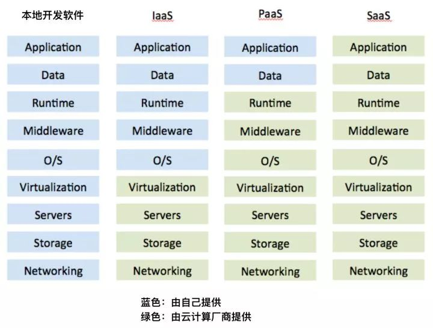

云计算行业  
SaaS (Software-as-a-Service)  
PaaS (Platform as a Service)  
IaaS (Infrastructure as a Service) 基础设施即服务
aPaaS (application Platform as a Service) 应用程序平台即服务

一套软件通常包含以下九个层次：  

应用（application）  
数据（data）  
运行库（runtime）  
中间件（middleware）  
操作系统（OS）
虚拟化技术（virtualization）  
服务器（servers）  
存储（storage）  
网络（networking）  

在过去，需要购买和维护这九种设备/技术，现在，有一些公司把其中某些层次整合起来（比如存储、服务器、操作系统）打包成一种服务对外出售，这些公司被称为`云计算公司`，他们的这种打包方法被称为`云技术`，这种服务形式也就是`云服务`  

基础架构即服务（IaaS），平台即服务（PaaS）和软件即服务（SaaS），区别在于哪些服务是云计算公司提供、哪些是自己提供。  
  

aPaaS理解为PaaS的一种`子形式`。  
aPaaS的全称是application Platform as a Service，即应用程序平台即服务。  
Gartner对其所下的定义是：“这是基于PaaS（平台即服务）的一种解决方案，支持应用程序在云端的开发、部署和运行，提供软件开发中的基础工具给用户，包括数据对象、权限管理、用户界面等。”  

特征：  
1. 提供快速开发的环境，用户在几个小时内就能完成应用的开发、测试、部署，并能够随时调整或更新。 
2. 低代码或零代码，非技术人员就能完成应用开发  

aPaaS和PaaS都可以完成软件的开发和部署，都支持云端访问。而两者的差异主要体现在`用户人群和使用环境不一样`：
PaaS包含所有平台级别的服务，需要`技术人员`在本地完成应用程序的开发和数据提供，然后部署到PaaS平台上，再分发给用户使用。
aPaaS是PaaS的一种子形式，在aPaaS模式下，`非技术人员可以直接`在云端完成应用程序的搭建、部署、使用、更新和管理。
