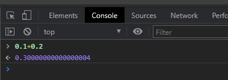

# JS 0.1 + 0.2 不等于 0.3
> 参考：
> [0.1 + 0.2不等于0.3？为什么JavaScript有这种“骚”操作](https://juejin.cn/post/6844903680362151950)
> [从0.1+0.2=0.30000000000000004再看JS中的Number类型]https://juejin.cn/post/6844903557326454791
> 高级程序设计-->因为舍入误差，精度丢失，如果是0.05 + 0.25 = 0.3这种就没有问题

例子：



### JS如何表示数字

js使用Number类型表示数字（整数和浮点数），遵循 [IEEE 754](https://zh.wikipedia.org/wiki/IEEE_754) 标准 通过64位(64bit) 来表示一个数字,（1 + 11 + 52），最大安全数字是 Math.pow(2, 53) - 1 (符号位 + 指数位 + 小数部分有效位）

- 在JS中能否表示的数字的绝对值范围是5e-324 ~ 1.7976931348623157e+308，这一点可以通过Number.MAX_VALUE和Number.MIN_VALUE来得到证实  
- 在JS中能够表示的最大安全整数的范围是：-9007199254740991 ~ 9007199254740991，这一点可以通过Number.MIN_SAFE_INTEGER和Number.MAX_SAFE_INTEGER来求证  


### JS 0.1 + 0.2 不等于 0.3原因
计算机中用二进制来存储小数，而大部分小数转成二进制之后都是无限循环的值，因此存在取舍问题，也就是精度丢失。

### 解决
1. 将数组转成整数再运算
```js
function add(num1, num2) {
  const num1Digits = (num1.toString().split('.')[1] || '').length;
  const num2Digits = (num2.toString().split('.')[1] || '').length;
  const baseNum = Math.pow(10, Math.max(num1Digits, num2Digits));
  return (num1 * baseNum + num2 * baseNum) / baseNum;
 }

 add(0.1, 0.2)
```
   
2. 三方库
   Math.js   big.js